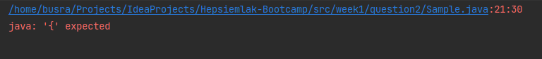
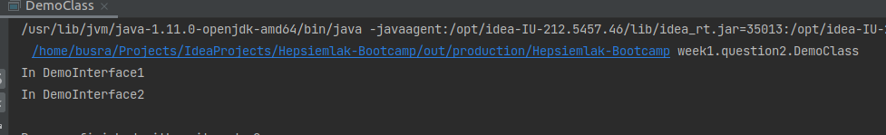

# Kalıtım 

Kalıtımda, ata sınıfın özelliklerinin kopyası onu miras alan alt sınıfın nesnesine aktarılır. Bu sebepten alt sınıfın nesnesini kullanarak 
hem alt hem de ata sınıfın alanlarına erişilebilir. 

## Çoklu Kalıtım
Çoklu kalıtım, nesneye yönelik programlamanın bir özelliğidir. Çoklu kalıtımda bir 
sınıf birden fazla ata sınıftan özelllik miras alabilir. Ancak bu yöntemde şöyle bir belirsizlik sorunu oluşabiliyor:

Örnekte olduğu gibi SuperClass1 ve SuperClass2 sınıflarımız Sample sınıfından miras alsın.
Bu iki sınıf da **print()** metodunu overrride ediyor. SubClass'ımız da hem SuperClass1'de hem de SuperClass2'den
miras alsın, yani çoklu kalıtım yapsın. SubClass, kalıtım yaptığı sınıflardan gelen **print()** metodunu override eder.
İşte tam bu noktada belirsizlik oluşur. Çünkü metodun adı ve imzası birebir aynıdır. Derleyici bu durumda hangi **print()**
metodunu çağıracağını bilemez. Derleme esnasında aşağıdaki hatayı veriyor. 

### Compile Time Error

Bu duruma **diamond problemi** de denir. Java, çoklu kalıtımı desteklemiyor ancak çoklu kalıtım yaparsanız
burada olduğu gibi "derleme zamanı hatası" alınır.

### Çözüm
Default metod ya da interface çoklu kalıtıma çözüm olarak kullanılabilir. 

Default metod, interface içerisinde "default" anahtar kelimesiyle tanımlanır. Bu metodları ezme(override) zorunluluğumuz yoktur.
Aynı isimde ve imzadaki bir default metodu farklı iki interfaceden implement edilebilir.

Örnektede de görüldüğü gibi aynı isme ve imzaya sahip default metodlar varsa interface adıya birlikte açıkça belirtilerek çağrılır.
Sırasıyla DemoInterface1 DemoInterface2 için print() metodunu çağırmıştır.

