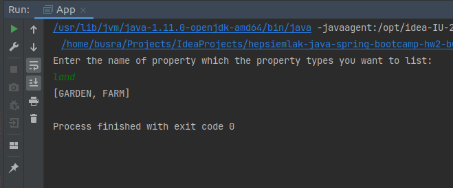
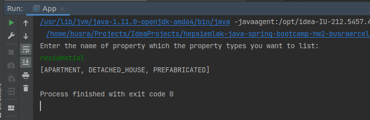
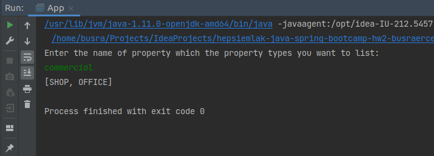

# SCREENSHOTS





# Creational(Oluşturucu) Tasarım Deseni Nedir

Oluşturucu tasarım desenleri nesnelerin oluşturulma şekliyle ilgilenir. Java'da yeni bir objeyi new operatörü kullanarak oluşturuyoruz. Mesela;

	Student student = new Student();

Ancak bu hard-coded yöntem iyi bir yaklaşım değildir. Çünkü zamanla sınıflar birbirine sıkı sıkıya bağlı(tightly coupled) hale gelebilir ve bu da  uygulamadaki bir implementation'ı değiştirmeyi zorlaştırabilir.

Oluşturucu tasarım kalıbı, nesneleri direk new operatörü kullanarak başlatmak yerine nesnelerin oluşturulma mantığını gizliyerek yeni bir nesne oluşturmayı sağlar. Bu da belirli kullanım durumlarında hangi nesnelerin oluşturulması gerektiği konusunda programa daha fazla esneklik sağlar.


### Oluşturucu Tasarım Desenleri

1- Factory Method Pattern
2- Singleton Pattern
3- Builder Pattern
4- Prototype Pattern
5- Object Pool Pattern

1- Factory Method Pattern

GoF'a göre bu model, bir nesnenin oluşturulması için interface tanımlar ama hangi sınıfın başlatılacağına(instantiate) alt sınıflar karar verir. Yani fabrika yöntemi bir sınıfın başlatılması kararını alt sınıflara bırakır.

Fabrika modelinde, factory sınıfı nesnenin oluşturulma mantığını gizleyerek bize nesneler sunar. Ortak bir interface kullanarak oluşturulan nesneye ulaşırız.

## Implementasyonu

## Hangi Durumlarda Fabrika Tasarım Desenini kullanmalıyım?

- Bir interface ya da abstract sınıfın implementasyonlarının sık sık değiştiği ya da değişebileceği durumlarda

2- Singleton Pattern

Singleton pattern Java'daki en basit tasarım desenlerinden biridir. Bu tasarım deseni, tek bir sınıf üzerinden sadece tek bir nesnenin oluşturulamasını sağlar.

## Implementasyonu

SingleObject sınıfı oluşturalım. SingleObject sınıfından nesne üretilmesini engellemek için constructor'ını private yaparız. SingleObject tipinde nesne döndüren static metodumuzla yukarda oluşturulmuş nesneyi döndürür.

```
public class SingleObject {

   //create an object of SingleObject
   private static SingleObject instance = new SingleObject();

   //make the constructor private so that this class cannot be
   //instantiated
   private SingleObject(){}

   //Get the only object available
   public static SingleObject getInstance(){
      return instance;
   }

   public void showMessage(){
      System.out.println("Hello World!");
   }
}
```

```
public class SingletonPatternDemo {
   public static void main(String[] args) {

      //illegal construct
      //Compile Time Error: The constructor SingleObject() is not visible
      //SingleObject object = new SingleObject();

      //Get the only object available
      SingleObject object = SingleObject.getInstance();

      //show the message
      object.showMessage();
   }
}
```

Kaynak: https://www.tutorialspoint.com/design_pattern/singleton_pattern.htm

## Hangi Durumlarda Singleton Tasarım Desenini kullanmalıyım?

- Oluşturulması maliyetli olan kaynaklar için (örneğin veritabanı bağlantı nesnesi)

- Performansı artırmak için tüm loggerları Singleton olarak almak good practicedir.

3- Builder Tasarım Deseni

Bir Builder sınıfı adım adım son nesneyi oluşturur. (step-by-step approach) Bu oluşturucu diğer nesnelerden bağımsızdır. Başka bir ifadeyle bir nesneyi oluşturmanın karmaşıklığı arttıkça, Builder deseni nesneyi oluşturmak için başka bir nesne(builder) kullanarak nesneyi oluşturmayı ayırır.

## Implementasyonu

Dışardaki objelerin direk erişimini engellemek için sınıfın tüm erişim belirteçleri(access modifiers) private olarak set edilir. Builder sınıfı static inner class olarak tanımlanır. Builder sınıf, dışardaki sınıfla aynı alanlara sahiptir. Kullanılması zorunlu değişkenler, Builder sınıf yapıcı metodunda parametre olarak geçilir ancak kalan değişkenler isteğe bağlı olarak setter metodlarla belirtilir. Setter metodlar da Builder objesini döndürür. Builder sınıf içerisinde tanımlanmış build metodu, dış sınıfın private yapıcı metodunu çağırır ve kendini parametre olarak geçer.

```
public static class BankAccountBuilder {
    
    private String name;
    private String accountNumber;
    private String email;
    private boolean newsletter;
    
    public BankAccountBuilder(String name, String accountNumber) {
        this.name = name;
        this.accountNumber = accountNumber;
    }

    public BankAccountBuilder withEmail(String email) {
        this.email = email;
        return this;
    }

    public BankAccountBuilder wantNewsletter(boolean newsletter) {
        this.newsletter = newsletter;
        return this;
    }
    
    public BankAccount build() {
        return new BankAccount(this);
    }
}

```

```
BankAccount newAccount = new BankAccount
  .BankAccountBuilder("Jon", "22738022275")
  .withEmail("jon@example.com")
  .wantNewsletter(true)
  .build();
 ```

Kaynak:  https://www.baeldung.com/creational-design-patterns

