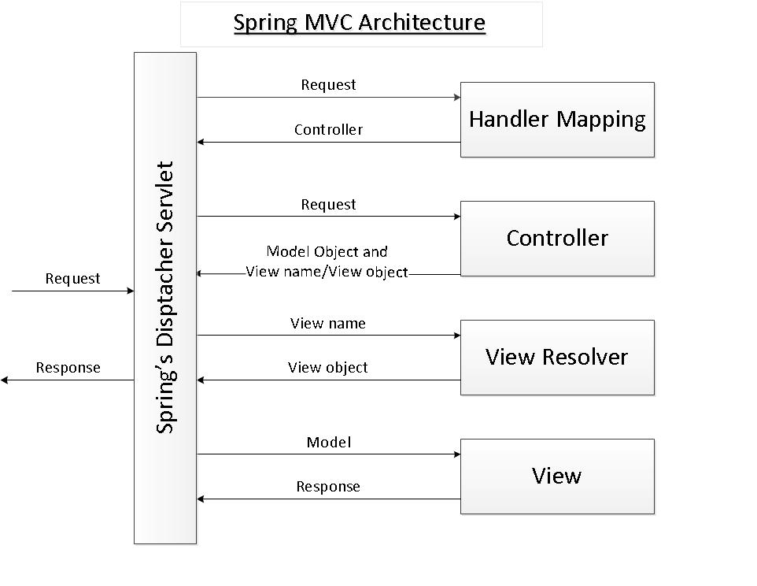

# Proje Gereklilikleri

- Maven (version: 3.5.2)
- Java (version: 1.8)
- Tomcat (version 9.0.2)

---
# Spring MVC

Spring MVC, Spring framework içinde bulunan, HTTP isteklerini ve cevaplarını kontrol eden bir kütüphanedir. Servlet API üzerine kurulmuştur. Spring MVC kütüphanesi Model-View-Controller mimarisini kullanır. Web uygulamaları geliştirmek için sahip olduğu hazır bileşenler esnek ve gevşek bağlı (loosely coupled) web uygulamalar geliştirme imkanı sağlar. Front controller tasarım kalıbını kullanır. Bu yapıda gelen istekleri karşılayan tek bir Servlet bulunur.

- Model, uygulamamızın verisi ve yapısını içerir. Yani uygulamanın kullandığı kuralları ve mantığı oluşturur. POJO'lardan oluşur.

- View, UI katmanı burada işlenir, tarayıcı için bir HTML cevabı döndürür.

- Controller gelen isteği işleyip modele ya da view'a yönlendirir.

## Spring MVC Framework Avantajları

- En önemli özelliği iş(bussiness), sunum(presentation) ve yönlendirme(navigation) mantığını birbirinden ayırmayı sağlar. (seperation of concerns)

- Seperation of concern sağladığındna modüler web uygulamalar oluşturmak için çok uygundur.

- Kolay test edilir. (Spring IOC kullandığı için)

- Ön yüzün ne olduğu önemsizdir. (view-agnostic)
  JSP, Velocity ya da farklı bir ön yüz teknolojisi kullanılabilir.

## Spring MVC Nasıl Çalışır?

Spring MVC web uygulaması geliştirmek için 3 komponent kullanır: model, view ve controller.

Spring MVC, Dispatcher Servlet etrafında kurgulanmıştır. Client'dan gelen istekleri ilk karşılayan yapı DispatcherServlet'tir. Ancak isteğin işleyen kısım Controller'dır. İsteği Contoller'a ileten HandlerMapping yapısı vardır. Örneğin gelen HTTP isteği "/addCustomer" şeklinde enpointe sahip olsun. HandlerMapping url'le eşleşen Controller'daki gerekli metodu bulur ve isteği iletir. Contoller bu aşamada model verisini set eder, geriye model döndürür. View bu model datasını işler ve tekrar DispatcherServlet'e iletir. Buradan da cevap client'a döner. 

---

# Java Server Faces (JSF)

JSF, Java web uygulamaları geliştirmek için kullanılan bir framework'tür. Model-View-Controller tasarım kalıbına dayanır. JSF'i öğrenmenin avantajlarından bir MVC yapısını anlamamızı sağlar ve Spring MVC ya da MVC yapısını kullanan farklı bir framework ile çalışmak istediğimizde öğrenmemiz daha hızlı olacaktır.

## MVC yapısı nedir?

Tarayıcıdan gelen istek ilk olarak Controller tarafından karşılanır. Web isteklerini yönlendirir ve Java kodunu çağırır.

Model, dataya erişimi sağlar. MySQL, Oracle gibi kullandığımız veritabanına ya da bir web servisine istek gönderebilir.

Controller, Model'dan datayı aldıktan sonra bu datayı View'a yönlendirir. Basitçe ifade etmek gerekirse, View gelen datayı kullanarak HTML sayfası oluşturur ve tarayıcıya yollar.

## JSF'in Avantajları

- Java uygulamarının ön yüzünü geliştirmek için kullanılan bir standard

- Birçok UI komponenti içerir(tablo veya form oluşturma gibi)

- Web istekleri için uygulamanın durumunu yönetir. Örneğin bir alışveriş uygulamasında kullanıcının sepete eklediği ürünleri takip etmek istersen. Ya da online sınavda öğrencinin her soruya verdiği cevabı tutmak ve sonucunda geçti/kaldı gibi bir sonuç üretmek istersen JSF'i kullanabilirsin.

- Form verisini işleme

## JSF Uygulamasının Komponentleri

JSF uygulaması aslında UI komponentleri bir düzene sokmak için kullanılan bir dizi web sayfasından oluşur. (facelets)

Beanler ve web.xml içerir.

## Arkaplanda JSF Nasıl Çalışır?

Web tarayıcısından gelen isteği JSF Faces Servlet karşılar. Servlet bu isteği uygun sayfaya yönlendirir ve sayfa da cevabı tarayıcıya döner. 

---
# Hibernate

Hibernate, veritabanıyla etkileşim kurmak için Java uygulamasının geliştirilmesini basitleştiren bir Java framework'üdür. Açık kaynak kodlu, lightweight, ORM (Object Relational Mapping) aracıdır. Hibernate, veri kalıcılığı için JPA'nın (Java Persistence API) özelliklerini uygular.

## ORM Aracı

Bir ORM aracı, veri oluşturmayı, veri işlemeyi ve veri erişimini basitleştirir. Nesneleri, veritabanında tutulan veriye map eder. ORM aracı, veritabanıyla etkileşim kurmak için dahili olarak JDBC API'sini kullanır.

## JPA Nedir?

Java Persistence API (JPA), ORM araçlarına belirli işlevsellik ve standart sağlayan bir Java özelliğidir.
**javax.persistence** paketi JPA sınıflarını ve arayüzlerini içerir.

## Desteklenen veritabları

- HSQL Database Engine
- DB2/NT
- MySQL
- PostgreSQL
- FrontBase
- Oracle
- Microsoft SQL Server Database
- Sybase SQL Server
- Informix Dynamic Server

