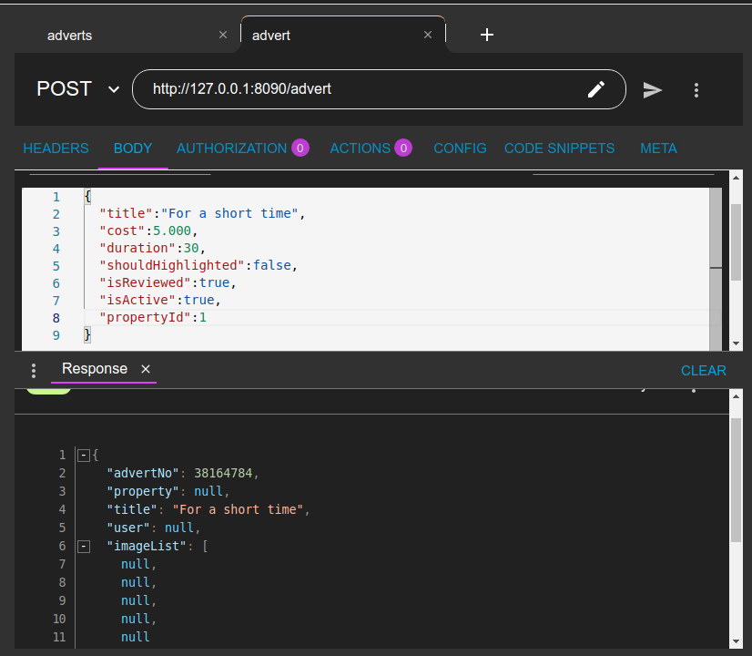
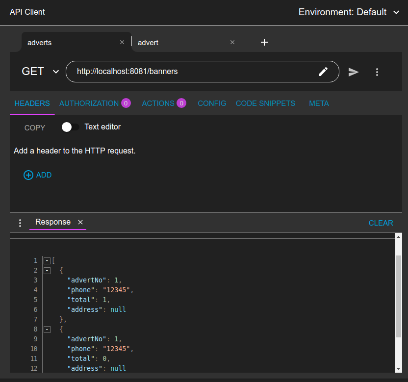
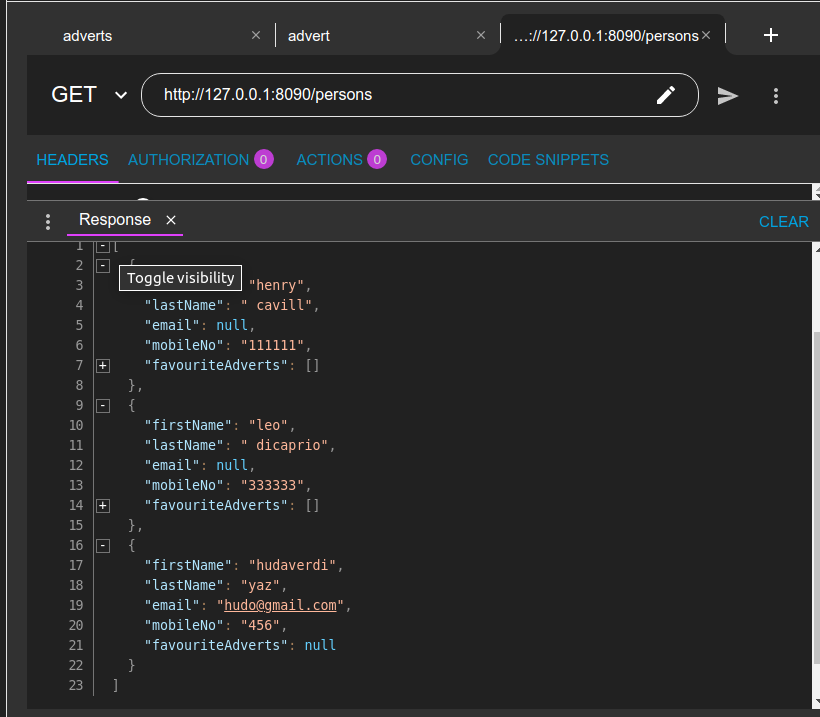
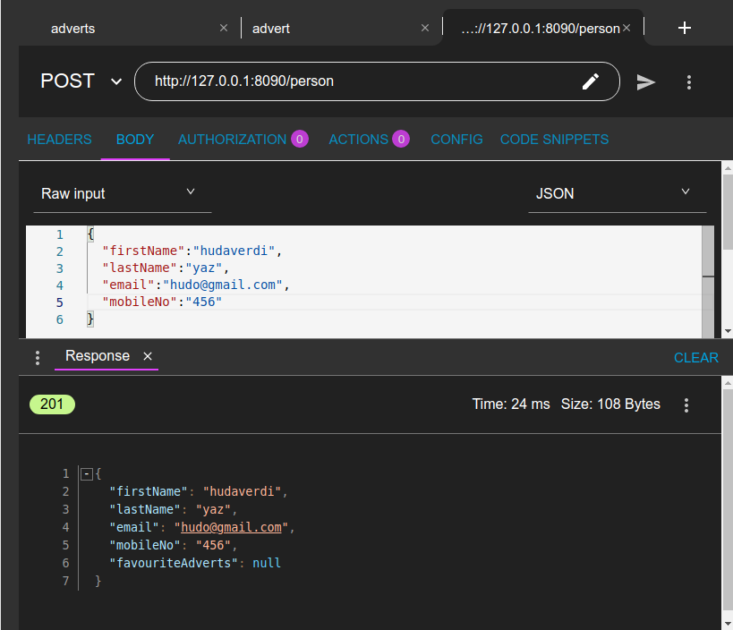
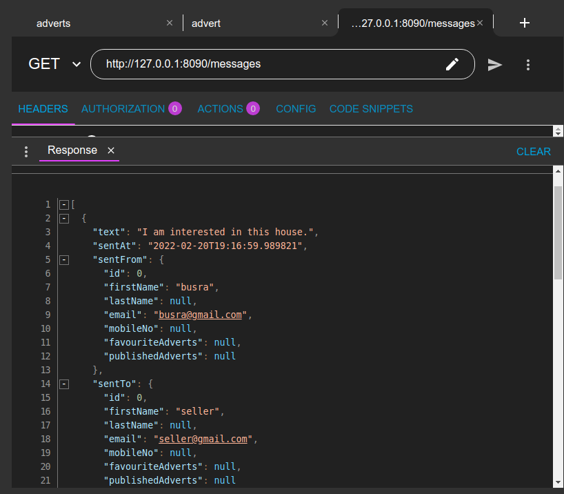
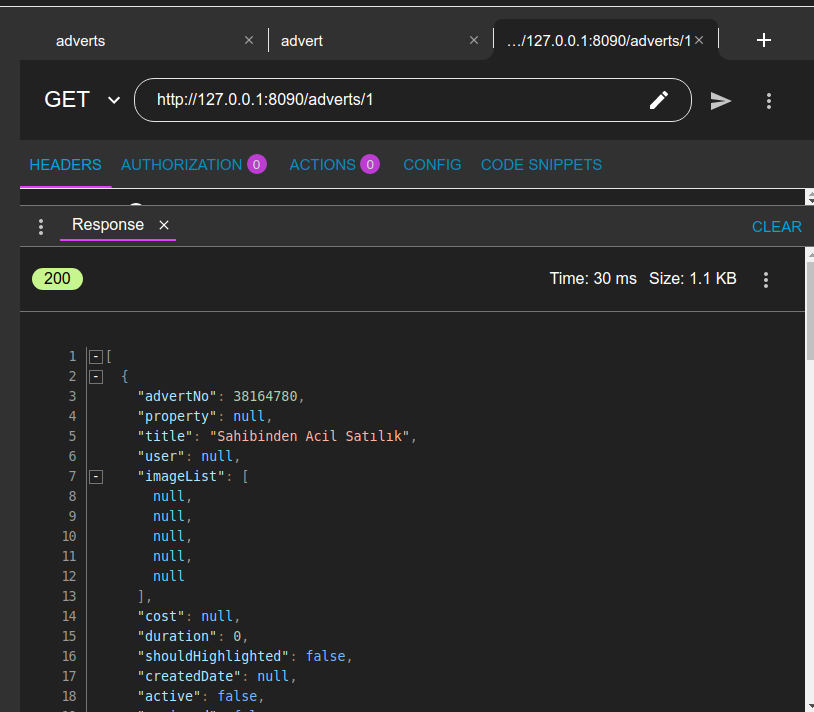

# Hepsiemlak-Java-Spring-Bootcamp-HW3

• EmlakBurada-Banner uygulamasına Spring feign client kullanarak da client oluşturun.

• EmlakBurada uygulaması ActiveMQ da kullanarak veri gönderimini sağlayın.

• EmlakBurada uygulamasında eksik kalan KullanıcınıService ve MessageService katmanlarının 
Controller katmanını yazın. Aşağıdaki işlemleri yapıyor olması gerek.

• EmlakBurada uygulamasında IlanController içerisinde id’si verilen kullanıcının favori ilanlarını 
getiren yeni bir method yazın.

• create
• findAll
• findOne

Bu dosya Patika.dev - Hepsiemlak Java & Spring Boot eğitimi 
dışında kullanılmamalıdır. 

Cem DIRMAN
---
### Docker image çalıştırma

    docker build -t activemq-img .
    docker run -it -p 8161:8161 activemq-img

### ActiveMQ ekranı

    http://localhost:8161

### Servisler arası haberleşme

Feign client ile emlak-banner'a istek atarak banner oluşturdum.

### Person API'leri

### Message API'leri

### Advert API'leri
