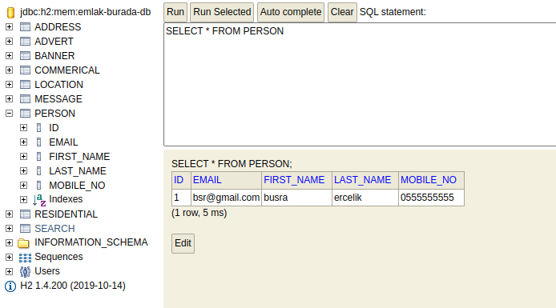

# Hepsiemlak-Java-Spring-Bootcamp-HW4

1. EmlakBurada, EmlakBurada-Banner ve EmlakBurada-Email servislerinin MySQL veya H2 
ile bağlantısını sağlayın ve CRUD işlemlerini spring-data-jpa ile gerçekleştirin. (80 PUAN)

2.  a) EmlakBurada-JDBC uygulaması hali hazırda User entity ile jdbc üzerinden CRUD 
operasyonları gerçekleştirilmektedir. Bu uygulama içerisine Advert entity de oluşturun yine CRUD 
operasyonlarını gerçekleştiren kodu yazın.(10 PUAN)

  b) JDBC, JdbcTempalete ve Hibernate ile CRUD operasyonlarını karşılaştıran makaleyi 
yazın.(5 PUAN)

3. Aşağıdaki kavramları araştırarak kullanım senaryolarını, hangi problemi nasıl çözdüklerini 
belirten makale yazın. (5 PUAN)

• PostgreSQL
• MongoDB
• Coucbase
• Redis
---
# H2 Database

    http://localhost:8085/h2-console

---
# JDBC

Jdbc stands for Java Database Connectivity. JDBC is a standard Java API that is connecting Java applications with database servers.(MySQL, Oracle, PostgreSQL etc.)

If you want your application to connect to PostgreSQL then you have to configure PostgreSQL JDBC Driver. You should configure JDBC Driver for chosen specific database. JDBC API is an interface and you can configure different implementations like Oracle, PostgreSQL.

# Spring JDBC

Spring provides a simplification in handling database access with the Spring JDBC Template. The Spring JDBC Template has the following advantages compared with standard JDBC.

The Spring JDBC template allows to clean-up the resources automatically, e.g. release the database connections.

The Spring JDBC template converts the standard JDBC SQLExceptions into RuntimeExceptions. This allows the programmer to react more flexible to the errors.

# JPA

Mapping Java objects to database tables and vice versa is called Object-relational mapping (ORM). The Java Persistence API (JPA) is one possible approach to ORM. Via JPA the developer can map, store, update and retrieve data from relational databases to Java objects and vice versa.

# Hibernate

JPA is a specification and several implementations are available. Popular implementations are Hibernate, EclipseLink and Apache OpenJPA. JPA permits the developer to work directly with objects rather than with SQL statements.

The mapping between Java objects and database tables is defined via persistence metadata. JPA metadata is typically defined via annotations in the Java class. Alternatively, the metadata can be defined via XML or a combination of both

---

# MongoDB vs PostgreSQL

MongoDB is a popular NoSQL database developed by MongoDB Inc. It uses JSON (JavaScript Object Notation)-like documents and optional schemas to store your data.
PostgreSQL, on the other hand, is a free, open-source RDBMS (Relational Database Management System).  Both these technologies are leveraged by organizations of all scales, both big & small, and depending on the situation, one can dominate over the other. 

If you already have a data model that is not going to change much, then PostgreSQL would be the best option. Migrating to a NoSQL document database can be a challenge if you have a large data model.
Creating relational data models take time where a document database such as MongoDB can be more fluid and works well with developers.

# Couchbase

Couchbase Server is a NoSQL document database for interactive web applications. It has a flexible data model, is easily scalable, provides consistent high performance and is capable of serving application data with 100% uptime.
Couchbase is built on three core principles: Simple, Fast, Elastic.

# Redis 

Redis (or) Remote Dictionary Server is an open-source, in-memory data structure store, used as a distributed, in-memory key-value database, cache, and message broker, with optional durability.
ome of the use cases of Redis are:
* Caching
* Messaging and Queue
* Session Store
* Machine Learning
* Real-Time Analytics